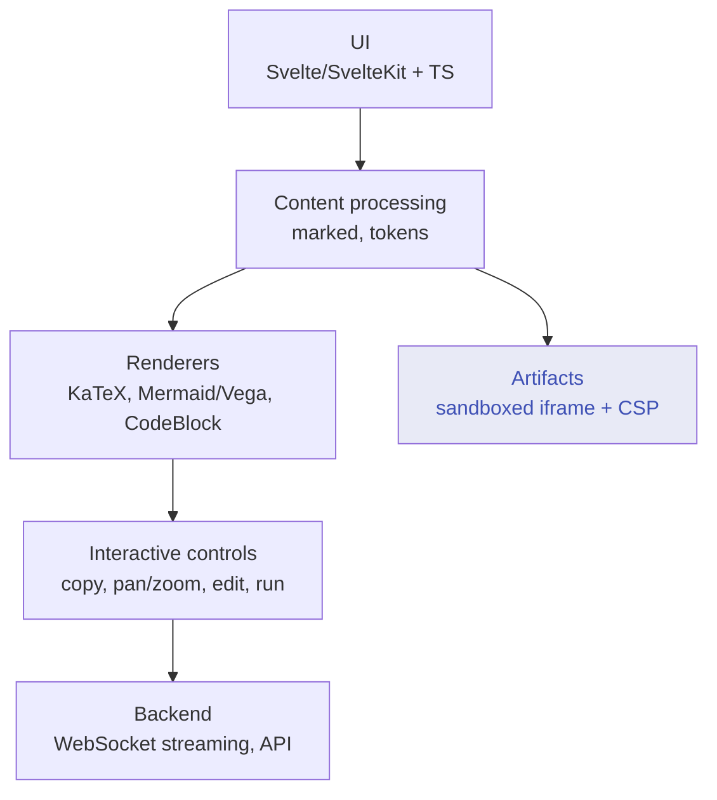

---
# Machine-readable anchor block — see I.8 / Part II.
covers_files:
  - src/lib/utils/csp.ts
  - src/lib/components/chat/Artifacts.svelte
  - src/lib/components/chat/Messages/ContentRenderer.svelte
  - src/lib/components/chat/Messages/CodeBlock.svelte
  - src/lib/components/chat/Messages/Markdown/KatexRenderer.svelte
  - src/lib/components/common/RichTextInput.svelte
covers_symbols:
  - { symbol: injectCsp, file: src/lib/utils/csp.ts }
  - { symbol: iframeLoadHandler, file: src/lib/components/chat/Artifacts.svelte }
  - { symbol: downloadArtifact, file: src/lib/components/chat/Artifacts.svelte }
  - { symbol: getKatexRenderer, file: src/lib/components/chat/Messages/Markdown/KatexRenderer.svelte }
  - { symbol: renderMermaid, file: src/lib/components/chat/Messages/CodeBlock.svelte }
  - { symbol: copyCode, file: src/lib/components/chat/Messages/CodeBlock.svelte }
  - { symbol: insertContent, file: src/lib/components/common/RichTextInput.svelte }
verified_against_commit: 85c9572936c5b00fb24e1ca7c98887036c7ed5fa
---

# Frontend Stack & Response Rendering

How Open WebUI renders model output in the browser: markdown, syntax-highlighted and
runnable code blocks, KaTeX math, Mermaid/Vega diagrams, and **sandboxed artifacts** that
execute HTML/CSS/JavaScript. Built on Svelte/SvelteKit + TypeScript.

> **Editorial note.** This document was imported from an earlier external guide and
> reconciled against the current code per the documentation standard. Claims that
> contradicted the code were corrected — most importantly the artifact **iframe security
> model** (§2/§4), which the original described as `src="data:…base64"` with a static
> `sandbox="allow-scripts allow-same-origin"`. The real implementation uses `srcdoc` with
> an **injected Content-Security-Policy** and a **default sandbox of `allow-scripts
> allow-downloads`**, where `allow-same-origin`/`allow-forms` are opt-in. Two ~600-line
> example dashboards were condensed to one representative artifact (I.4: describe
> capability, don't transcribe large payloads); no capability claim was dropped.

---

## 1. Frontend Architecture

| Layer | Implementation (grep these) |
|---|---|
| UI / chat | Svelte/SvelteKit + TypeScript; chat message rendering under `src/lib/components/chat/` |
| Markdown | `marked` (frontend) → `Markdown.svelte` / `MarkdownInlineTokens.svelte` token components |
| Code | `CodeBlock.svelte` (highlight, `copyCode`, `renderMermaid`, `executePython`) |
| Math | `KatexRenderer.svelte` (`getKatexRenderer` → `katex.renderToString`) |
| Diagrams | `CodeBlock.svelte` → `SVGPanZoom.svelte` for `mermaid` / `vega` / `vega-lite` |
| Artifacts | `Artifacts.svelte` (sandboxed `<iframe srcdoc>`); detection in `ContentRenderer.svelte` |
| Editor | `RichTextInput.svelte` (TipTap/ProseMirror; code-block-aware Tab/Enter, `insertContent`) |



---

## 2. Content Security Model (corrected)

Two tiers, by context:

- **Inline markdown** — sanitized before display; no script execution. Static formatted
  content (headings, lists, tables, links, images, inline code).
- **Artifacts** — the LLM's HTML/SVG is rendered inside an **isolated `<iframe srcdoc=…>`**
  in `Artifacts.svelte`, with two stacked controls:
  1. **Injected CSP.** The artifact HTML is passed through `injectCsp(content, $config?.ui?.iframe_csp ?? '')`
     (`src/lib/utils/csp.ts`). The admin-configured `iframe_csp` is injected into the
     artifact document, bounding which scripts/resources/connections it may load. With no
     `iframe_csp` set, the injected policy is empty.
  2. **Sandbox attribute.** Default is **`sandbox="allow-scripts allow-downloads"`**.
     `allow-forms` and `allow-same-origin` are **opt-in**, gated on user settings
     (`$settings?.iframeSandboxAllowForms` / `$settings?.iframeSandboxAllowSameOrigin`,
     both default `false`).

> **I.6 — do not "simplify" the sandbox string.** It is built so that
> same-origin and form submission are **off by default**; granting `allow-same-origin`
> unconditionally would let artifact JS reach cookies/storage of the app origin. The
> opt-in gating is deliberate.

### Security context comparison (corrected)

| Context | JavaScript | Network requests | `localStorage` / same-origin APIs | Access to WebUI app | Use cases |
|---|---|---|---|---|---|
| **Markdown (inline)** | ❌ | ❌ | ❌ | ❌ | Static content |
| **Artifact (iframe)** | ✅ `allow-scripts` | ⚠️ bounded by injected `iframe_csp` | ⚠️ requires opt-in `allow-same-origin` | ❌ sandbox isolation | Interactive dashboards/apps |

So "fire a webhook from an artifact" works only insofar as the injected CSP permits the
connection; storage/same-origin APIs require the user to enable `allow-same-origin`.

---

## 3. Code Block System (`CodeBlock.svelte`)

Per-language rendering with a floating copy button (`copyCode`), syntax highlighting, and
specialized renders:

- **Mermaid / Vega / Vega-Lite** — `['mermaid', 'vega', 'vega-lite'].includes(lang)`
  renders via `renderMermaid` (and friends) into an interactive `SVGPanZoom` wrapper
  (pan/zoom, theme-aware), with a plain `<pre>` fallback on parse errors.
- **Runnable Python** — `executePython` runs `python`/`py` blocks (the doc's original was
  silent on this); output is shown inline. This is a verified capability, not a contradiction.

### Editor keyboard handling (`RichTextInput.svelte`)

Inside a code block the editor intercepts keys via an `isInside(['codeBlock'])` check:
`Tab` inserts an indent instead of moving focus; `Enter` defers to the editor's normal
block behavior. `insertContent` is the exported entry point for programmatic inserts.

```js
// RichTextInput.svelte (illustrative — grep isInside / event.key === 'Tab')
if (event.key === 'Tab' && isInside(['codeBlock'])) { /* insert indent; preventDefault */ }
```

---

## 4. Artifacts System (`Artifacts.svelte`)

### Detection (`ContentRenderer.svelte`)

Artifacts open automatically when the streamed token's language qualifies **and** the
context allows it — note the `!$mobile` and `$chatId` guards the original omitted:

```svelte
onUpdate={async (token) => {
  const { lang, text: code } = token;
  if (
    ($settings?.detectArtifacts ?? true) &&
    (['html', 'svg'].includes(lang) || (lang === 'xml' && code.includes('svg'))) &&
    !$mobile &&            // artifacts are disabled on mobile
    $chatId
  ) {
    await tick();
    showArtifacts.set(true);
    showControls.set(true);
  }
}}
```

### Rendering (the real iframe — corrected)

```svelte
<iframe
  bind:this={iframeElement}
  title="Content"
  srcdoc={injectCsp(contents[selectedContentIdx].content, $config?.ui?.iframe_csp ?? '')}
  sandbox="allow-scripts allow-downloads{allowForms ? ' allow-forms' : ''}{allowSameOrigin ? ' allow-same-origin' : ''}"
  on:load={iframeLoadHandler}
></iframe>
```

Controls in `Artifacts.svelte`: `navigateContent` (prev/next between artifacts),
`showFullScreen` (fullscreen), and `downloadArtifact` (downloads the current content as a
`text/html` Blob). `iframeLoadHandler` wires up in-iframe link handling and drag behavior.

### What artifact JavaScript can / cannot do

| Can (within sandbox + CSP) | Cannot |
|---|---|
| Manipulate its own DOM; handle events; timers; Canvas/WebGL; load CDN libraries **if the injected CSP allows the origin** | Read Open WebUI stores/state or the parent DOM (sandbox isolation) |
| Make network requests **permitted by `iframe_csp`** | Use same-origin APIs (cookies, `localStorage`) unless `allow-same-origin` is enabled |
| Submit forms **only if** `allow-forms` is enabled | Break out of the iframe / affect the main app |

### Representative artifact (condensed)

A self-contained interactive page — e.g. a Chart.js dashboard with buttons that mutate
state and (CSP permitting) `fetch()` a webhook:

```html
<!doctype html>
<html><head><script src="https://cdn.jsdelivr.net/npm/chart.js"></script></head>
<body>
  <button onclick="add()">Add point</button>
  <canvas id="c"></canvas>
  <script>
    const chart = new Chart(c, { type: 'line', data: { labels: [], datasets: [{ data: [] }] } });
    function add() {
      chart.data.labels.push(new Date().toLocaleTimeString());
      chart.data.datasets[0].data.push(Math.random() * 100);
      chart.update();
    }
  </script>
</body></html>
```

(The CDN `<script>` and any `fetch()` succeed only if `$config.ui.iframe_csp` permits those
origins/connections.)

---

## 5. Mathematical Formulas (KaTeX)

`KatexRenderer.svelte` lazy-loads KaTeX (`getKatexRenderer`) and renders with
`katex.renderToString(content, { displayMode, throwOnError: false })`, injecting the result
as **HTML/CSS** via `{@html …}` (corrected: the original claimed "SVG output" — KaTeX emits
HTML/CSS, not SVG). `throwOnError: false` gives graceful fallback on invalid syntax.

Formatting rules that still hold:
- Inline: `$ … $`; block: `$$ … $$`.
- Block math needs blank lines above/below and must be outside code fences.

```markdown
The complexity:

$$
\text{Time} = \sum_{i=1}^{n} \log_2(i)
$$
```

---

## 6. Mermaid / Diagram System

`CodeBlock.svelte` parses `mermaid` (and `vega`/`vega-lite`) blocks and mounts them in
`SVGPanZoom.svelte`:

```svelte
{#if ['mermaid', 'vega', 'vega-lite'].includes(lang)}
  <SvgPanZoom svg={...} content={_token.text} />
{:else}
  <pre class="mermaid">{code}</pre>
{/if}
```

Capabilities: pan & zoom (mouse/touch), copy, theme synchronization, and graceful fallback
on invalid syntax. Supported Mermaid diagram families (flowchart, sequence, class, gantt,
pie, state, …) are whatever the bundled `mermaid` version accepts — validate against the
Mermaid Live Editor rather than trusting a fixed list here.

---

## 7. Mobile & Responsive Behavior

- The chat UI is responsive (collapsible sidebar, touch-friendly controls, touch pan/zoom
  on diagrams).
- **Artifacts are disabled on mobile** — enforced by the `!$mobile` guard in the detection
  block above, so artifact HTML renders as a normal (static) code block on small screens.

---

## 8. Guidance for LLM Response Formatting

| Content | Recommended format | Notes |
|---|---|---|
| Code | fenced block with explicit language | enables highlighting + copy; `python`/`py` are runnable |
| Interactive app | ` ```html ` (or `svg`, or `xml` containing `<svg>`) | opens an artifact on desktop; **mobile renders it static** |
| Diagram | ` ```mermaid ` (also `vega`/`vega-lite`) | pan/zoom, theme-aware |
| Math | `$…$` / `$$…$$` with blank lines | KaTeX; keep outside code fences |
| Tables / links / images | standard markdown | responsive |

Artifact authoring caveats that follow from §2/§4: don't rely on `parent`/app access (sandbox
isolation); don't assume `localStorage`/cookies (needs opt-in `allow-same-origin`); external
scripts and `fetch()` work only within the admin's `iframe_csp`.

---

## 9. Troubleshooting

| Symptom | Likely cause | Fix |
|---|---|---|
| Raw LaTeX shown | math inside a code fence, or missing blank lines | move math outside fences; add blank lines |
| Code not highlighted | no language on the fence | use ` ```language ` |
| Mermaid shows as text | invalid syntax | validate in Mermaid Live Editor |
| Artifact didn't open | `detectArtifacts` off, **on mobile**, no `$chatId`, or non-qualifying lang | check the §4 detection conditions |
| Artifact script/network blocked | injected `iframe_csp` disallows it, or needs `allow-same-origin`/`allow-forms` | adjust `ui.iframe_csp`; enable the sandbox setting |

---

## Verification Recipe

Run from the repo root. Symbol resolution for manual `git log -L` uses the overrides in
`docs/DOCUMENTATION_STANDARD.md`.

```bash
# Security model: srcdoc + injected CSP + opt-in sandbox flags (NOT data: base64 / static allow-same-origin)
grep -rn "export function injectCsp" src/lib/utils/csp.ts
grep -rn "srcdoc={injectCsp\|sandbox=\"allow-scripts allow-downloads\|iframeSandboxAllowSameOrigin\|iframeSandboxAllowForms" src/lib/components/chat/Artifacts.svelte
grep -rn "iframe_csp" src/lib/components/chat/Artifacts.svelte

# Artifact detection conditions (incl. !$mobile and $chatId)
grep -rn "detectArtifacts\|\['html', 'svg'\].includes(lang)\|lang === 'xml'\|!\$mobile\|\$chatId" src/lib/components/chat/Messages/ContentRenderer.svelte

# Artifact controls
grep -rn "const downloadArtifact\|const iframeLoadHandler\|const navigateContent\|const showFullScreen" src/lib/components/chat/Artifacts.svelte

# Code block: copy, mermaid/vega via SvgPanZoom, runnable python
grep -rn "const copyCode\|const renderMermaid\|const executePython\|'mermaid', 'vega', 'vega-lite'\|SVGPanZoom" src/lib/components/chat/Messages/CodeBlock.svelte

# Math is HTML/CSS via KaTeX (not SVG)
grep -rn "renderToString\|throwOnError: false\|@html" src/lib/components/chat/Messages/Markdown/KatexRenderer.svelte

# Editor code-block keyboard handling
grep -rn "isInside(\['codeBlock'\])\|export const insertContent" src/lib/components/common/RichTextInput.svelte

# Frontend markdown library
grep -rln "from 'marked'" src/lib | head -1
```
